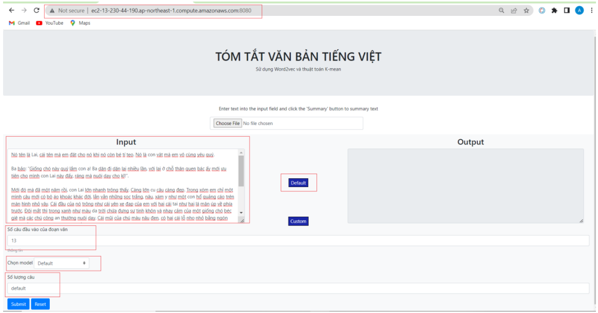
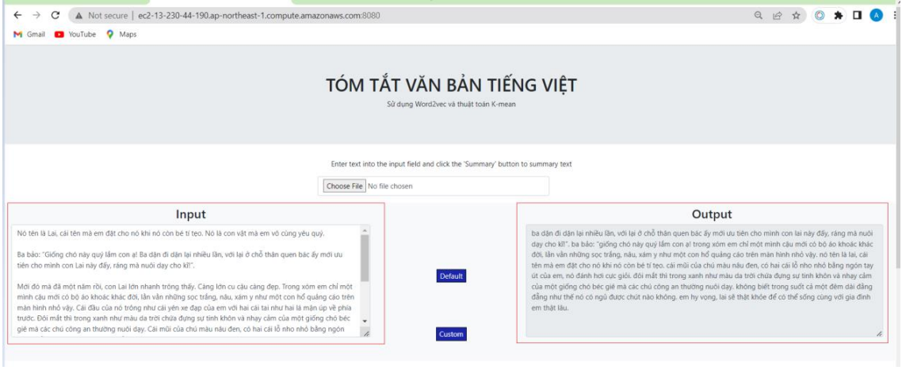

# text-summarization-with-kmeans
This project can help us summary Vietnamese text automatically. We use word2vec technique to vectorize every sentences in input and use K-Means Clustering to cluster these vectors.

### Steps to start
#### 1. Install library
```pip install -r requirements.txt```

#### 2. Run steps in get_data.ipynb file to get data, then build to sentences.pkl file.

#### 3. Run steps in train_w2v.ipynb file to train and build file w2v model file.

#### 4. Run file main.py to start server.

### Web page interface
Input

Result



